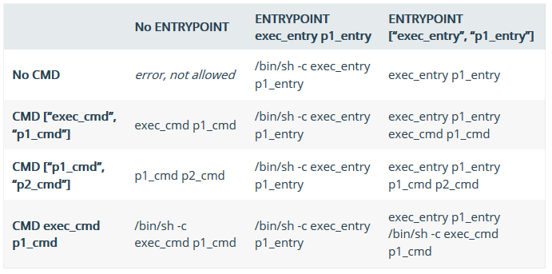

# Course TreinaWeb Docker - Primeiros Passos

## O que é um container

É uma forma de virtualização no nível do sistema operacional, que possibilita a execução de múltiplos sistemas isolados em um único sistema real, compartilhando os recursos do kernel para economizar recursos de disco, memória RAM e CPU.
Containers tem como propriedade serem descartáveis.

## Qual a diferença entre VMs e Containers


Containers são criados utilizando os recursos do sistema operacional da própria máquina, e já as VMs acabam dependendo de um sistema operacional próprio, aumentando assim o custo por cada VM nova criada.

## Diferenças de dockers por sistema operacional

Sistemas diferentes do Linux acabam utilizando uma versão mais leve do linux para poder rodar a arquitetura do docker normalmente.

## O que são containers e imagens

Pegando a comparação entre uma VM, imagine que o container é a própria maquina virtual em execução. Ela consegue oferecer serviços para outras maquinas, mas antes disso essa VM precisa de um sistema operacional configurado e instalado para essa VM ser útil. Pense nas imagens como um sistema operacional.

A partir da imagem nós definimos o que determinado container irá executar, quais programas estão disponíveis com ele e por aí vai. Se compara com uma linguagem de programação orientada a objetos, pensa na imagem como a sua classe e no container como a instância daquela classe em execução.

## Comandos

Lista as imagens disponíveis no sistema

```bash
docker images
```

Baixa uma imagem, podendo definir uma versão (tag) específica

```bash
docker pull ubuntu
docker pull ubuntu:16.10
```

Procura por uma imagem específica

```bash
docker search <nome-da-imagem>
docker search php
```

Executa um container a partir de uma imagem

```bash
docker run <nome-da-imagem>
docker run ubuntu
```

Analisa os containers em execução no sistema

```bash
docker ps
# Lista todos os containers já executados com a flag -a
docker ps -a
```

A opção "q" retorna somente o código dos containers

```bash
docker ps -q
# Lista todos os containers já executados com a flag -a
docker ps -qa
```

Para executarmos um container de uma imagem executamos o seguinte comando:
OBS: Caso a imagem não exista, o docker tentará executar o pull do nome da imagem.

```bash
docker run <nome-da-imagem>
docker run ubuntu
```

Executa um container permitindo a sua interação com o console do container (-it)

```bash
docker run ubuntu -it bash
```

Caso queira que após a parada da execução do container ele não feche o console, usamos o parametro (-itd)

```bash
docker run -itd <nome-imagem> <local-da-linha-de-comando-da-imagem>
docker run -itd ubuntu /bin/bash
```

Para a execução de um container

```bash
docker stop <container-id>
```

Para a execução de todos os containers

```bash
docker stop $(docker ps -q)
```

Remove um container específico

```bash
docker rm <container-id>
```

Para limpar a lista de containers já executados usamos

```bash
docker rm $(docker ps -qa)
```

Remove uma imagem do sistema

```bash
docker rmi <container-id>
```

Remove uma lista de imagens do sistema

```bash
docker rmi $(docker images -q)
```

## Como funcionam as layers das imagens

Uma das grandes vantagens em utilizar o Docker é a forma que ele gerencia as imagens. Ao contrario de utilizar um único bloco de arquivos, é possível reutilizar partes de uma imagem já existente e criar novas imagens a partir delas. Isso é possível graças a arquitetura de camadas que o Docker adota para as suas imagens.

Ao criar uma imagem, são criadas varias camadas que são reaproveitáveis entre si, e ao criar uma nova imagem derivada, ao invés de duplicar toda essa imagem novamente, ela cria uma camada diferencial ao topo da imagem anterior e assim economiza espaço em disco.


Cada layer de imagem é identificada a partir de um hash único e o conteúdo da imagem não pode ser modificado depois de criado. Quando os containers entram em execução, é criada uma camada de leitura e escrita onde é possível armazenar temporariamente os dados manipulados pelo container.

Com isso, qualquer alteração que ocorra dentro do container é descartada depois que ele for removido.

Porém é possível salvar esse diferencial de arquivos modificados e criar uma nova imagem derivada, persistindo as alterações de forma permanente.

## Criando imagens

```bash
docker commit [opcoes] <container-id> [nome-repositorio[:tag]]
```

Para adicionar o nome da imagem:

```bash
docker commit -m="Comentário" -a="Nome do Autor" efd92885851d nome-da-imagem
docker commit -m="Include htop" -a="Lucas" efd92885851d treinaweb/ubuntu:v2
```

Podemos listar as layers que uma imagem acaba utilizando com o seguinte commando:
OBS: Certos comandos via bash podem ficar ocultos nesta listagem

```bash
docker history <nome-da-imagem||hash-da-imagem>
```

Usamos o parâmetro **-n** para escolher entre uma lista de hashs dos containers acompanhado de um numero da posição na lista

```bash
# Usando com o parâmetro, podemos pegar o ultimo container executado
docker ps -aq -n 1
```

Para adicionar um comando a uma imagem sem entrar dentro de seu console, executamos:

```bash
docker exec -it <hash> <comando>
docker exec -it 5577f4938fe0 apt-get install vim
```

Para adicionar um apelido a imagem usamos:

```bash
docker run -it --name <apelido> <nome-imagem>
docker run -it --name ub treinaweb/ubuntu:v3
```

Podemos limpar todos os containers que estão parados com o comando:

```bash
docker container prune
```

## Dockerfile

Usado para automatizar a criação de imagens.

Para iniciar a criação de uma imagem a partir do arquivo **dockerfile**, usamos o comando:

```bash
docker build -t <nome-da-nova-imagem> <diretório-do-arquivo-dockerfile>
docker build -t treinaweb/ngnix .
```

### Comandos Dockerfile

* **FROM**: Imagem base para criação de outra imagem;
* **RUN**: Executa um comando de linha de comando;
* **COPY**: Usado para copiar arquivos de fora do container e enviar para dentro dele
* **ADD**: Igual ao **COPY**, porem ele já extrai arquivos .zip, .tar, etc;
* **ENV**: Adiciona uma variavel de ambiente com valor x;
* **VOLUME**: Define diretórios dentro do container para persistir os arquivos, independente se o container está executando ou não, criando um volume dentro da máquina física para armazenar esses arquivos quando passado por parâmetro para utilizá-los;
* **EXPOSE**: Utiliza uma porta para ser usada de acesso externamente, mapeando a porta do computador que executa o container com a porta do próprio container;
* **ENTRYPOINT**: Comando não é possível substituir ao rodar o container. Parecido um valor constante;
* **CMD**: Comando com possibilidade de substituir através do parâmetros ao rodar o container. Parecido com uma variavel;

### Comandos que usam parâmetros

Quando for utilizado dentro do **Dockerfile** o comando **EXPOSE** que utiliza uma determinada porta, precisamos passar o parâmetro **-p** ao iniciar o container.

```bash
# porta-local:porta-container
docker run -p 8080:8080 --rm -it treinaweb/ngnix
```

Para mapear pastas de dados usados no computador para o container
quando utilizado no **Dockerfile** o comando **VOLUME**, devemos passar o parâmetro **-v**

```bash
docker run -p 8080:8080 -v D:\git\course-treina-web-docker-primeiros-passos\html:/usr/share/nginx/html --rm -it treinaweb/ngnix
```

### ENTRYPOINT e CMD

Para explicar com mais detalhes a relação entre **ENTRYPOINT** e **CMD**, podemos recorrer a essa tabela presenta na documentação do Docker.



Tanto o **ENTRYPOINT** com o **CMD** podem ser executados de duas formas:

Exec:

```bash
CMD ["cmd", "param1", "param2"]
```

Shell:

```bash
CMD cmd param1 param2
```

Ambas as formas nesse exemplo produzem o mesmo resultado, mas é recomendado pela documentação do Docker que a forma **exec** seja utilizada.

Para uma referência completa de todas as opções disponíveis para utilizar no seu Dockerfile, consulte a [documentação de referência](https://docs.docker.com/engine/reference/builder).

## Volumes

Lista todos os volumes disponíveis no sistema.

```bash
docker volume ls
```

Remove o ultimo volume criado.

```bash
docker volume remove $(docker volume ls -q | head -n 1)
```

Mapeia o ultimo volume criado com um novo container.

```bash
docker run --rm -it -v $(docker volume ls -q | head -n 1):/myvol treinaweb/volume ls /myvol
```

Cria um novo volume nomeado.

```bash
docker volume create <nome-do-container>
docker volume create treinaweb
```

Cria um container anexando o volume nomeado treinaweb.

```bash
docker run --rm -it -v treinaweb:/myvol treinaweb/volume ls /myvol
```

Lista as informações do volume nomeado treinaweb

```bash
docker volume inspect treinaweb
```

## Gerenciamento de redes entre containers

Os comandos relacionados a keyword **network** são utilizado para realizar a comunicação entre containers, sendo muito similar a uma rede.

Lista os network disponíveis

```bash
docker network ls
```

Para remover uma network

```bash
docker network rm <network-id>
```

Inspeciona informações do network bridge

```bash
docker network inspect bridge
```

Cria um novo network do tipo bridge chamado treinaweb.
É utilizado a criação de uma nova network para que possamos acessar os outros containers pelos seus respectivos nomes que foram atrelados a eles.

```bash
docker network create --driver bridge treinaweb
```

Executa um novo container, inserindo o network adapter chamado treinaweb
Parâmetro **-itd** é usado para executando um container em background

```bash
docker run --network=treinaweb -itd --name container3 busybox
```

Conecta um container já em execução a uma network, definindo um apelido dentro daquela rede

```bash
docker network connect --alias c1 treinaweb container1
```

Conectar-se a um container executando

```bash
docker attach <nome-container>
```

Criar um nome alias de network para o container, para assim ele ser acessado por outros containers com este alias, utilizando assim o parâmetro **--net-alias**

```bash
docker run --network treinaweb -itd --name container4 --net-alias c4 busybox
```

Para adicionar um nome alias de network para um container que já esta ativo usamos

```bash
docker network connect --alias c1 treinaweb container1
```

## Docker Store

Para achar imagens docker para utilizar em seu projeto, podemos acessar a Docker Store, onde é o local para encontrar imagens pré configuradas para utilização.

## Docker Compose

Ele é uma ferramenta utilizada para automatizar as etapas de criação e execução dos nossos containers.
O Docker Compose utiliza de um arquivo yaml chamado **docker-compose**, onde nele é adicionado quais os containers que serão utilizados e quais serão suas configurações especificas.

Para executarmos o Docker Compose utilizamos o seguinte comando:

```bash
docker-compose build
```

### Projeto Rails com Docker Compose

Configurar o container web:

```bash
docker-compose run web rails new . --force --database=postgresql --skip-bundle
```

Para mudar as permissões dos arquivos caso eles estejam criados com o usuário root, usamos:

```bash
sudo chown -R $USER: .
```

Copie o arquivo **database.yml** com o comando:

```base
cp ../database.yml config/database.yml
```

Depois disso executamos a configuração do database:

```base
docker-compose run web rake db:create
```

Agora podemos iniciar o docker-compose para iniciar a aplicação:

```base
docker-compose up
```
