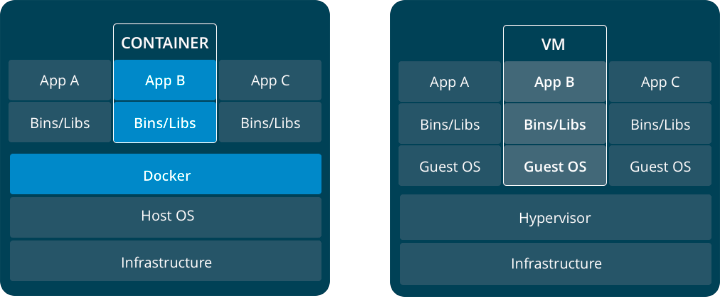

# Course TreinaWeb Docker - Primeiros Passos

## O que é um container

É uma forma de virtualização no nível do sistema operacional, que possibilita a execução de múltiplos sistemas isolados em um único sistema real, compartilhando os recursos do kernel para economizar recursos de disco, memória RAM e CPU.
Containers tem como propriedade serem descartáveis.

## Qual a diferença entre VMs e Containers



Containers são criados utilizando os recursos do sistema operacional da própria máquina, e já as VMs acabam dependendo de um sistema operacional próprio, aumentando assim o custo por cada VM nova criada.

## Diferenças de dockers por sistema operacional

Sistemas diferentes do Linux acabam utilizando uma versão mais leve do linux para poder rodar a arquitetura do docker normalmente.

## Containers e Imagens

### O que são containers e imagens

Pegando a comparação entre uma VM, imagine que o container é a própria maquina virtual em execução. Ela consegue oferecer serviços para outras maquinas, mas antes disso essa VM precisa de um sistema operacional configurado e instalado para essa VM ser útil. Pense nas imagens como um sistema operacional.

A partir da imagem nós definimos o que determinado container irá executar, quais programas estão disponíveis com ele e por aí vai. Se compara com uma linguagem de programação orientada a objetos, pensa na imagem como a sua classe e no container como a instância daquela classe em execução.

### Layers

São como commits do git, onde estas são reaproveitadas durante a utilização de imagens.

### Comandos executados

Lista as imagens disponíveis no sistema

```bash
docker images
```

Baixa uma imagem, podendo definir uma versão (tag) específica

```bash
docker pull ubuntu
docker pull ubuntu:16.10
```

Procura por uma imagem específica

```bash
docker search <nome-da-imagem>
docker search php
```

Executa um container a partir de uma imagem

```bash
docker run <nome-da-imagem>
docker run ubuntu
```

Analisa os containers em execução no sistema

```bash
docker ps
# Lista todos os containers já executados com a flag -a
docker ps -a
```

A opção "q" retorna somente o código dos containers

```bash
docker ps -q
# Lista todos os containers já executados com a flag -a
docker ps -qa
```

Para executarmos um container de uma imagem executamos o seguinte comando:
OBS: Caso a imagem não exista, o docker tentará executar o pull do nome da imagem.

```bash
docker run <nome-da-imagem>
docker run ubuntu
```

Executa um container permitindo a sua interação com o console do container (-it)

```bash
docker run ubuntu -it bash
```

Caso queira que após a parada da execução do container ele não feche o console, usamos o parametro (-itd)

```bash
docker run -itd <nome-imagem> <local-da-linha-de-comando-da-imagem>
docker run -itd ubuntu /bin/bash
```

Para a execução de um container

```bash
docker stop <container-id>
```

Para a execução de todos os containers

```bash
docker stop $(docker ps -q)
```

Remove um container específico

```bash
docker rm <container-id>
```

Para limpar a lista de containers já executados usamos

```bash
docker rm $(docker ps -qa)
```

Remove uma imagem do sistema

```bash
docker rmi <container-id>
```

Remove uma lista de imagens do sistema

```bash
docker rmi $(docker images -q)
```
